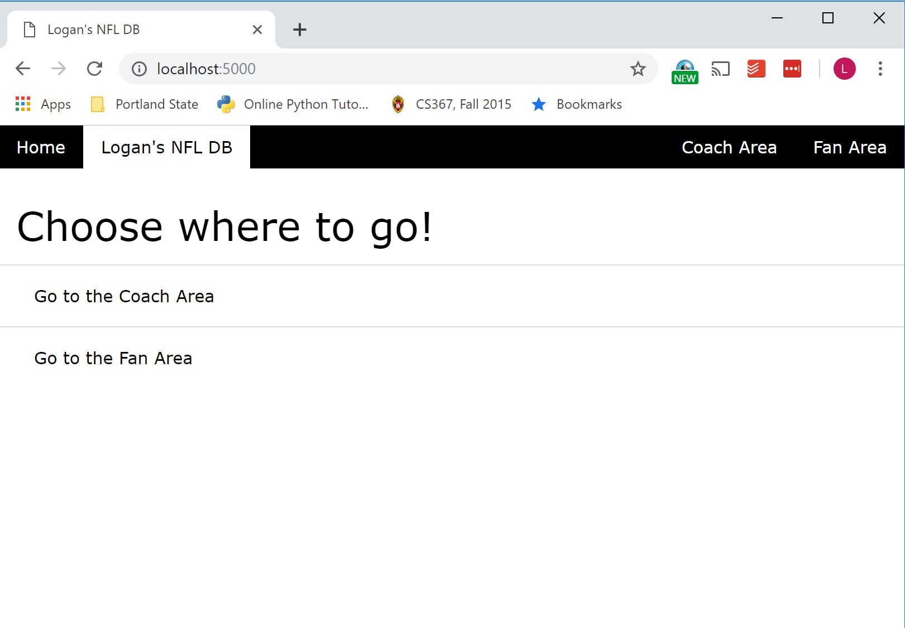
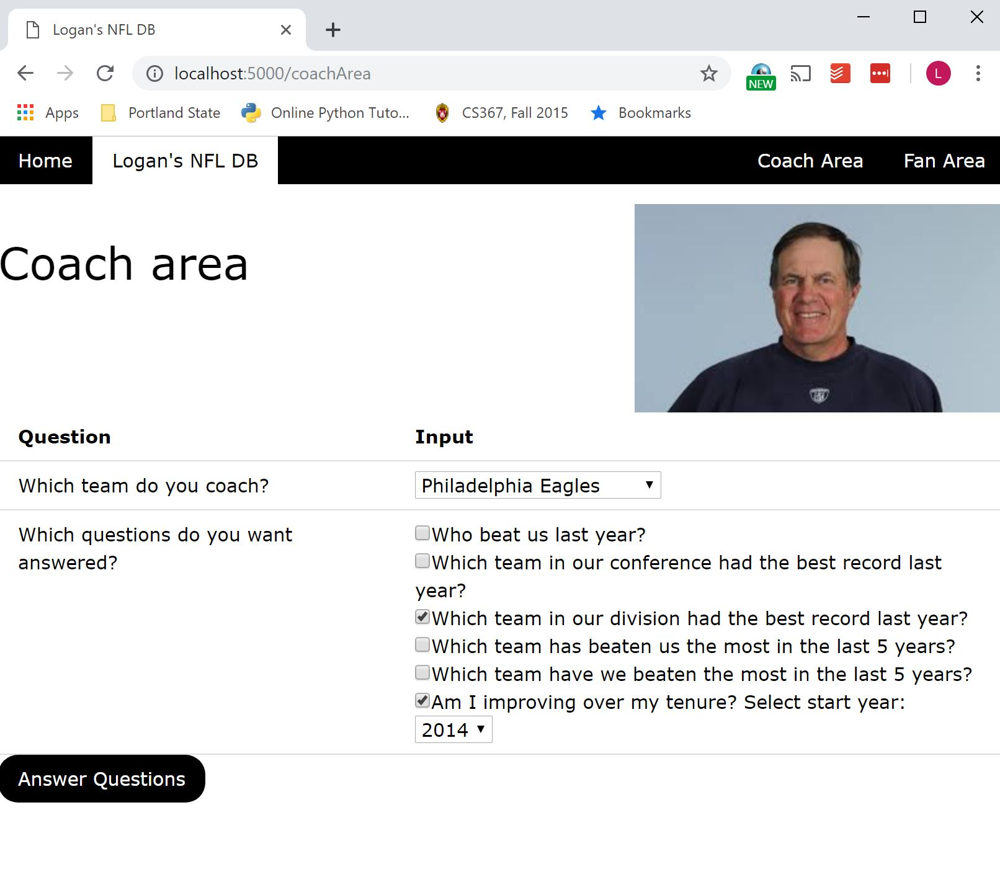
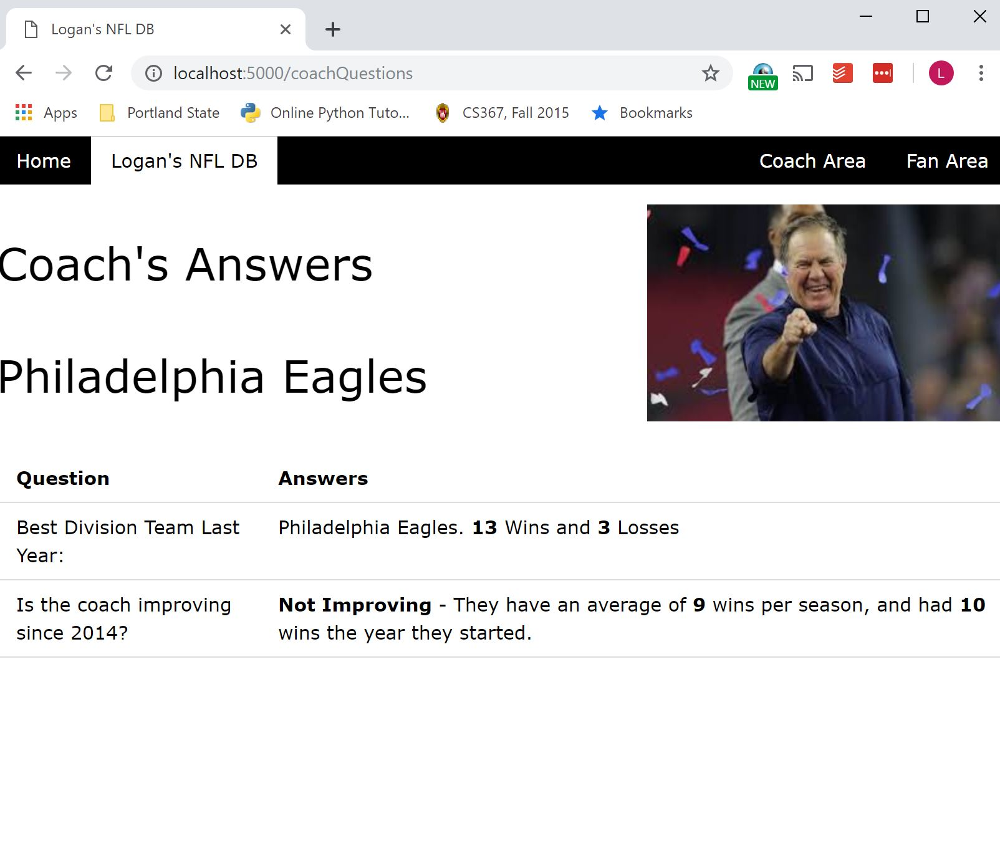
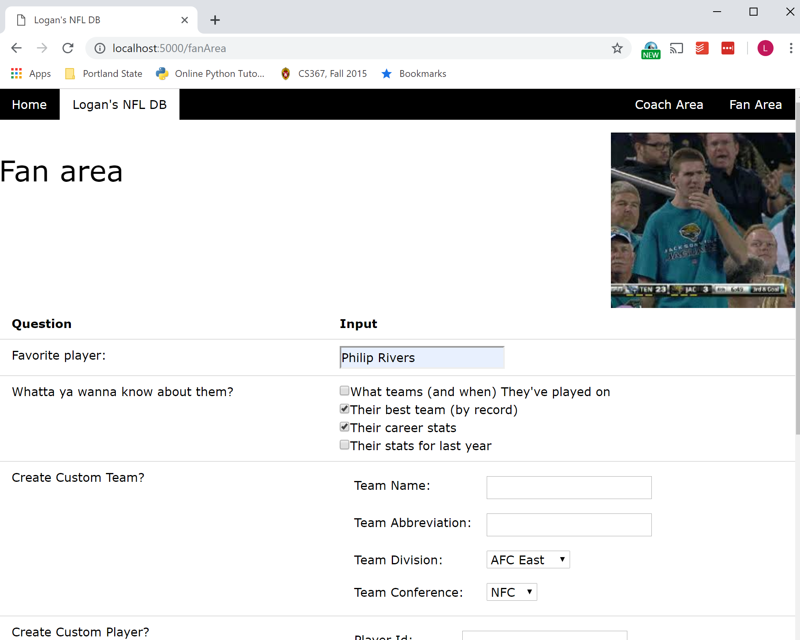
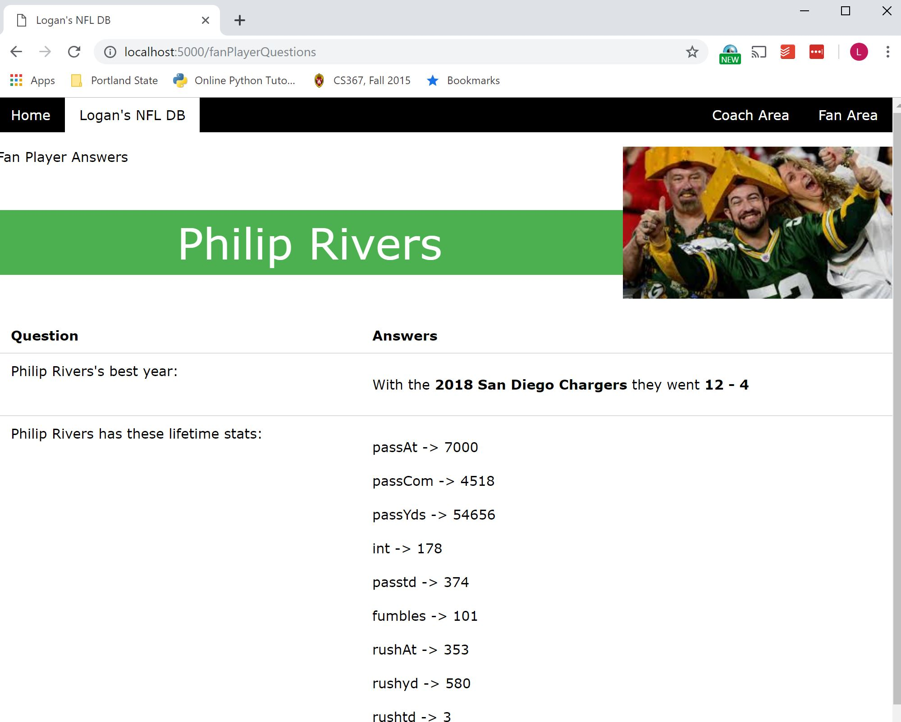

# Nfl Statistics DB

A simple NFL stats database with a lightwieght frontend.  Supports low-level logical queries.  Dependent on the fine data from sports-reference.com. BIG Shoutout to [@roclark](https://github.com/roclark) and the [sportsreference python package](https://github.com/roclark/sportsreference) as this is the entire backbone of this project.  Big shoutout as well to the good people at [https://www.pro-football-reference.com/](Sports Reference NFL Division), and especially [@KennyJackelen](https://github.com/kennyjackelen) as this is where the data originally comes from. [Follow him on Twitter](https://twitter.com/kennyjackelen?lang=en).

## Setup

#### Dependencies
Make sure you have python3 and pip3 installed.  Prefereably have a virtual environment set up.  Note this is tested on unix systems (macos/linux), I'm sure Windows will have a slightly different setup.

* [Python3 Installation](https://www.python.org/downloads/)
* Pip Installation: 
    * `curl https://bootstrap.pypa.io/get-pip.py -o get-pip.py`
    * `python get-pip.py`
* Virtual Environment:
    * `python3 -m pip install --user virtualenv`
    * `python3 -m virtualenv env`
    * `source env/bin/activate`
* Programmatic access to a __postgres__ database (username, password, db, port, host)
    * [Basic Postgres Setup Guide](https://www.techrepublic.com/blog/diy-it-guy/diy-a-postgresql-database-server-setup-anyone-can-handle/)

#### Initialization
1. Clone this repo:
    * `git clone https://github.com/loganballard/nfl_database.git`
2. Run the provided shell script from the root directory:
    * `driver.sh`
    * Run the initial setup step (NOTE THIS WILL TAKE FOREVER)
    * __Important Note__: Environment variables are preconfigured as defaults. However, if you've set up your postgres database, you'll want to set these enviornment variables either by changing the provided setup script or setting then in your environment before running:
        * __PGDB__: postgres database name, defaults to "postgres"
        * __PGUSERNAME__: postgres user name, defaults to "postgres"
        * __PGPASSWORD__: postgres password, defaults to "admin"
        * __PGHOST__: postgres host URI, defaults to "localhost"
        * __PGPORT__: postgres port, defaults to "5432"
        * __NFLDBSTARTYEAR__: The NFL season to start collecting data from, defaults to 2010
        * __NFLDBENDYEAR__: The NFL season to stop collecting data from, defaults to 2019
        * __NFLSUBDB__: The schema name for your NFL Database, defaults to "nflDb"
3. Once the setup is complete:
    * `driver.sh`
    * Run option 2
4. In a web browser, navigate to `localhost:5000` and poke away!

## Screenshots

* Home:

* Coach's Area:

* Coach Question Result:

* Fan Area:

* Fan Question Result:

